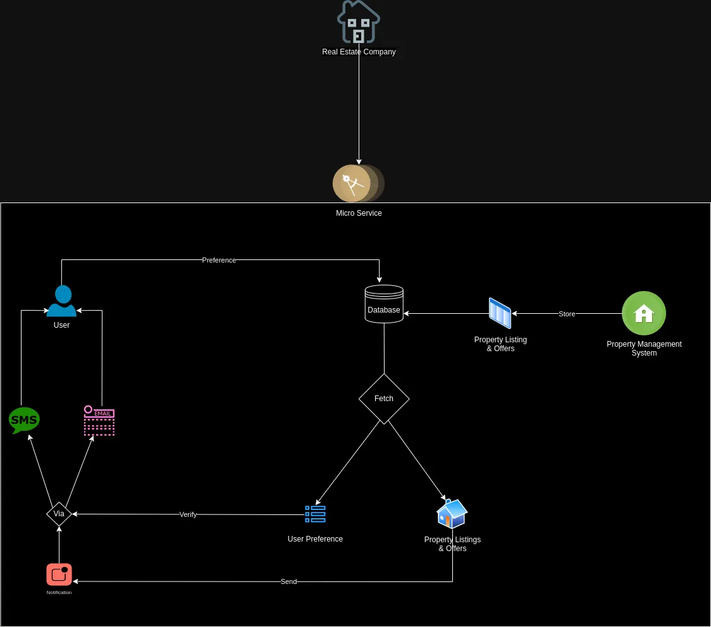

# Property Alert Notifications Microservice

## Overview

The Property Alert Notifications Microservice is designed to facilitate sending personalized notifications to users about property listings and offers based on their preferences. This documentation provides an overview of the microservice architecture, functionalities, setup instructions, and testing procedures.

## Architecture Overview

The Property Alert Notifications Microservice architecture is depicted below:

<div style="text-align:center;">
    
</div>

The microservice is built using FastAPI, a modern web framework for building APIs with Python. It utilizes SQLAlchemy for database interaction and Pydantic for data validation and serialization. The architecture consists of the following components:

1. **FastAPI Application**: Implements RESTful endpoints for managing user preferences and scheduling notifications.
2. **CRUD Operations**: Provides CRUD operations for interacting with the database to retrieve and update user preferences.
3. **Database**: Utilizes SQLite as the database backend for storing user preferences.
4. **Integration of Task Queue**: Implemented a simple queue system for task management to handle asynchronous processing of notification tasks.

## Usage

### Setup Instructions

To set up the microservice, follow these steps:

1. Clone the repository to your local machine.
2. create virtual enviorment `python3 -m venv .venv`.
3. activate the enviorment `source .venv/bin/activate`.
4. Install dependencies using `pip install -r app/requirements.txt`.

## Running the FastAPI Application

To start the FastAPI application using `uvicorn`, follow these steps:

1. **Navigate to the Project Directory:**
   Open a terminal and ensure you are in the root directory of your project. Navigate using the command:

   ```bash
   cd Property-Alert-Notifications-Microservice/

1. **Start the Application:**
   Execute the application with the uvicorn command. Include the --reload option to enable automatic reloading during development:

   ```bash
   uvicorn app.main:app --reload

   The --reload flag allows the server to restart automatically whenever code changes are detected, which is very useful for development.

### API Endpoints

#### Update User Preferences

- **URL**: `/preferences/{user_id}`
- **Method**: POST
- **Description**: Update user preferences by user ID.

#### Retrieve User Preferences

- **URL**: `/preferences/{user_id}`
- **Method**: GET
- **Description**: Retrieve user preferences by user ID.

#### Schedule Notifications

- **URL**: `/notifications/{user_id}`
- **Method**: POST
- **Description**: Schedule notifications for a user.


## Testing

Unit tests and mock-up integration tests are provided to ensure the reliability and functionality of the microservice. Run unit tests using `pytest`.

## Known Limitations or Areas for Improvement

While the Property Alert Notifications Microservice is functional and reliable, there are some known limitations and areas for improvement:

1. **Mocked Notifications**: The current implementation uses mocked email and SMS notifications for demonstration purposes. Integrating with real email and SMS services would provide more realistic functionality.

2. **Scalability**: Scalability considerations, particularly in handling high volumes of traffic, need further exploration. Implementing strategies such as load balancing and horizontal scaling would enhance the microservice's ability to handle increased demand.

3. **Security**: Enhancements in security measures, such as implementing authentication and authorization mechanisms, would enhance the overall security posture of the microservice.
